# Netra

[](https://github.com/zyvorai/netra/actions/workflows/ci.yml)
[](LICENSE)
[](CHANGELOG.md)

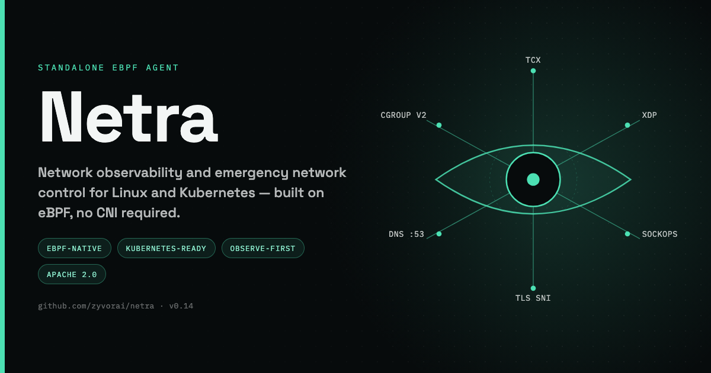

**Standalone eBPF network observability and emergency network control for Linux/Kubernetes — with optional Cilium + Hubble enrichment.**

📖 **[Read the full docs](https://zyvorai.github.io/netra/)** — quickstart, architecture, security model, and a product tour.

Netra does not require Cilium. The node agent owns its own programs and maps below `/sys/fs/bpf/netra`, attaches to Linux cgroup v2 for CNI-independent workload coverage, and can optionally attach TCX/XDP programs to selected interfaces. If Cilium/Hubble exists, Netra can still manage `CiliumNetworkPolicy` and display Hubble flows, but both integrations are opt-in.

Netra is observe-first. All custom enforcement is protected by a time-limited lease and automatically returns to **observe** when the lease expires, the agent cannot refresh controller state, the controller restarts, or HA leadership changes.

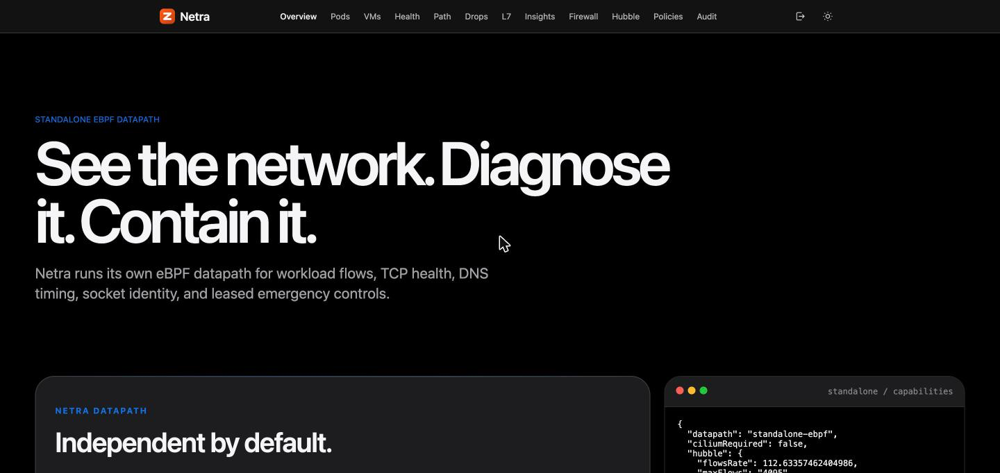

## Contents

- [Dashboard gallery](#dashboard-gallery)
- [Standalone eBPF capabilities](#standalone-ebpf-capabilities)
- [Firewall dashboard page](docs/firewall.md)
- [TCP Path Diagnostics](#tcp-path-diagnostics)
- [Drop Diagnostics](#drop-diagnostics)
- [Kernel Network Diagnostics](#kernel-network-diagnostics)
- [Packet Capture](#packet-capture)
- [Behavior and Rate Insights](#behavior-and-rate-insights)
- [Hook model](#hook-model)
- [Important visibility boundaries](#important-visibility-boundaries)
- [Optional Cilium / Hubble integration](#optional-cilium--hubble-integration)
- [HTTPS default](#https-default)
- [Signing in](#signing-in)
- [Suite placement (PacketWolf)](#suite-placement-packetwolf)
- [Architecture](#architecture)
- [Repository](#repository)
- [Prerequisites](#prerequisites)
- [Build](#build)
- [Standalone Helm install](#standalone-helm-install)
- [eBPF CLI examples](#ebpf-cli-examples)
- [Safety and persistence](#safety-and-persistence)
- [License](#license)

## Dashboard gallery

Live walkthrough — Overview, the Firewall page's unified rules table and NetPol v2 allow-list, then a real in-browser VNC console connected to a running KubeVirt VM — captured against a live lab deployment, not a mockup:

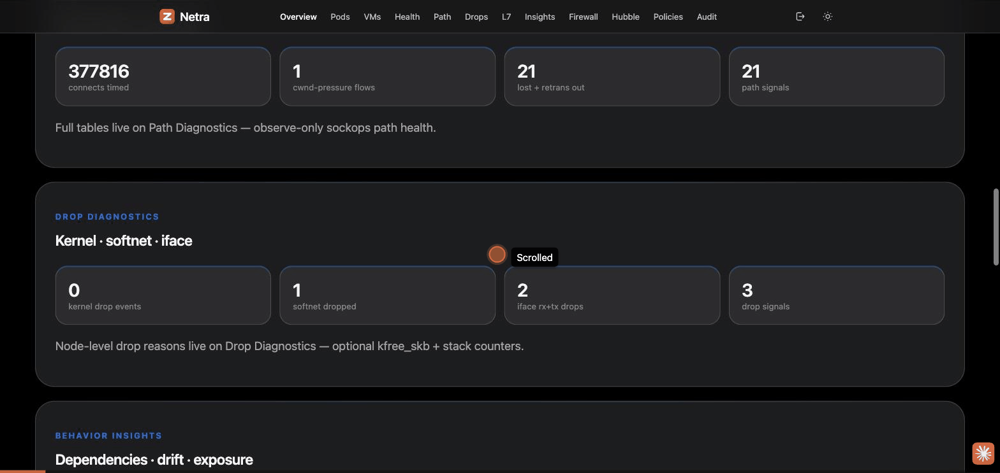

Live UI captures from a lab deployment (HTTPS `:30870`). Overview and Pods lockdown appear above and under Cilium integration; the rest of the console:

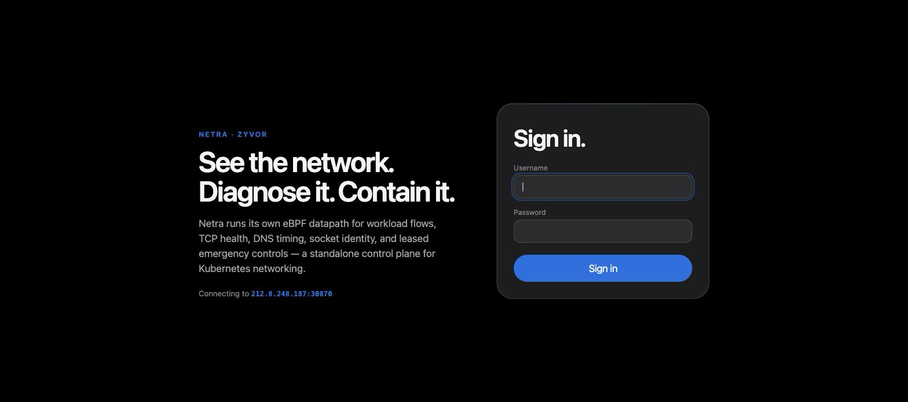

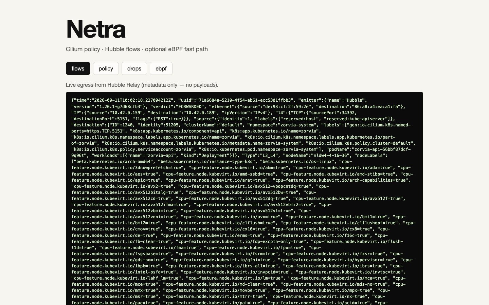

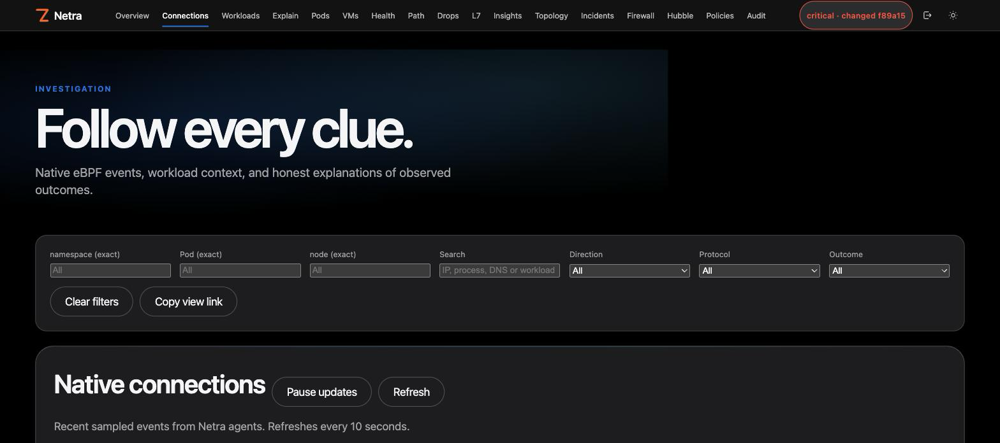

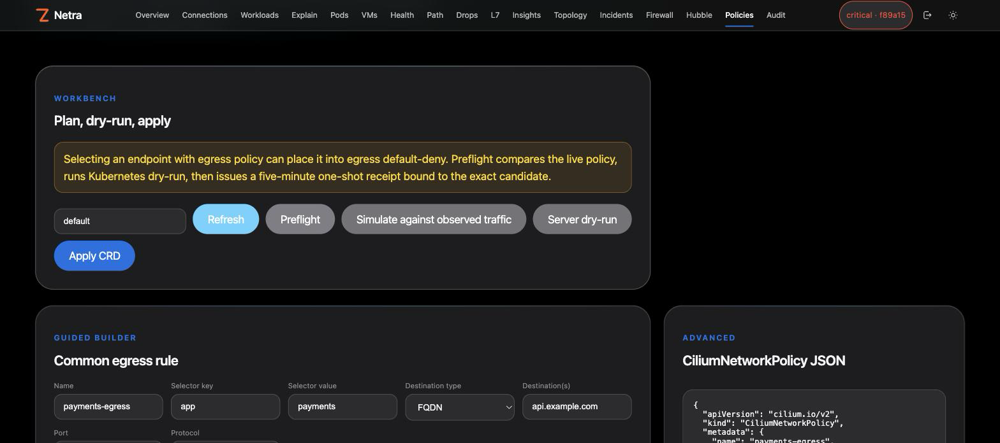

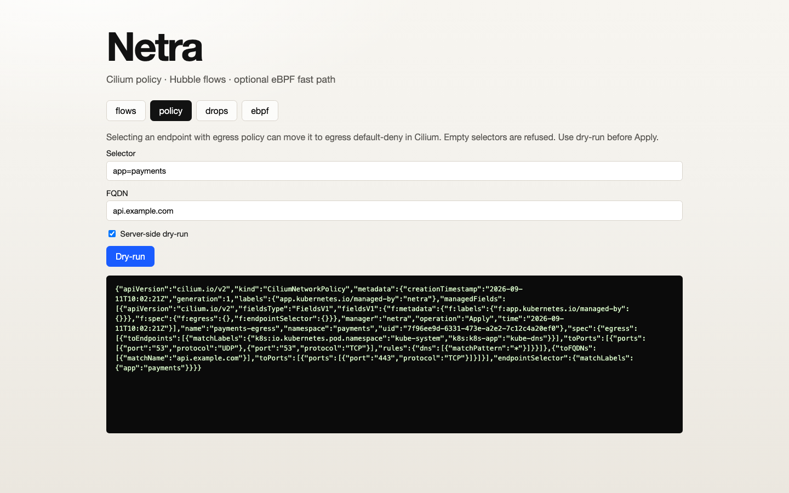

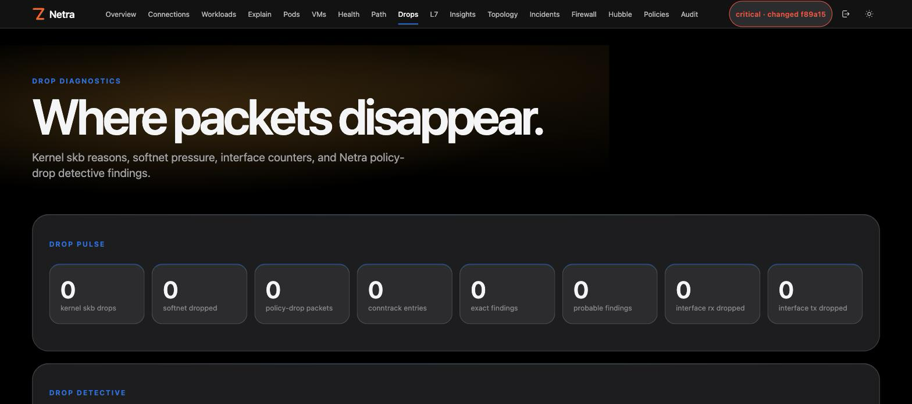

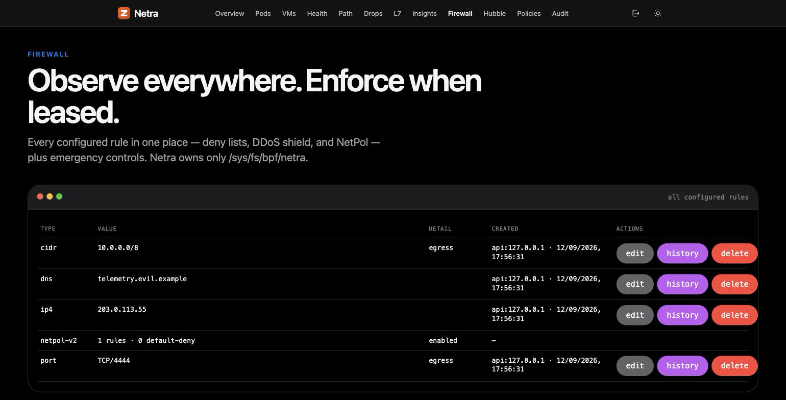

## Standalone eBPF capabilities

### Observability

- IPv4 and IPv6 source:port → destination:port flow counters with packets, bytes and blocked counts.
- Ingress/egress and hook attribution (`cgroup`, optional `tcx`, optional `xdp`, socket hooks).
- TCP, UDP, ICMP and ICMPv6 visibility; TCP flag metadata for parsed TCP packets.
- Sampled flow-header events without application payload collection.
- Cleartext UDP/53 DNS query-name events.
- Socket context for new TCP connect / UDP sendmsg operations: PID, UID, cgroup ID and Linux process `comm`.
- Kubernetes attribution on cgroup traffic: namespace, pod, immediate owner, container ID and cgroup ID.
- Exact workload network topology derived from cgroup-attributed tuple counters.
- TCP connection health from cgroup sockops: active/passive establishes, closes, SRTT/min RTT, retransmissions, RTOs, congestion window, segments and byte counters.
- TCP path diagnostics from sockops: active connect-establishment latency, `packets_out`/`snd_cwnd` pressure, `lost_out`, `retrans_out`, cumulative retransmits, delivered-rate samples, MSS and TCP state.
- Exact TCP SYN/SYN-ACK/FIN/RST counters by cgroup.
- Cleartext UDP/53 DNS request/response latency, response-code and failure counters.
- Best-effort TLS ClientHello SNI metadata from single egress skbs, attributed to cgroup/workload.
- Best-effort cleartext HTTP/1 method + Host metadata from single egress skbs; no request body collection.
- Exact per-workload TCP-connect / UDP-sendmsg destination-attempt counters for fan-out and connection-health analysis.
- Deterministic network-health signals for high RTT, retransmit/RTO pressure, reset ratio, DNS failure ratio and DNS latency.
- Top destinations, top DNS names, top processes, block reasons and hook/protocol/direction summaries.
- Stale-agent detection and per-node hook coverage in the dashboard.
- Kernel skb drop-reason counters through an optional raw `kfree_skb` tracepoint, plus Linux softnet and interface drop/error counters.
- Prometheus control-plane/aggregate metrics at `/metrics`.
- Optional interval-driven anomaly alerting via multi-channel notify (webhook, email, Slack, Teams, Twilio SMS/WhatsApp, HTTP bridge), with severity-escalation-aware cooldown deduplication and concurrent per-channel delivery. Off by default; HA-aware (leader-only). Opt-in auto-capture on critical softnet/congestion/drop-spike signals persists PCAPs for download. See `docs/alerting.md` and `docs/capture.md`.
- Pull-based SIEM export of audit events, health anomalies, and incident clusters as JSON, JSONL, ArcSight CEF, RFC5424 syslog, or OTLP/HTTP JSON Logs (`GET /api/v1/export/audit`, `GET /api/v1/export/events`). Observe-only, stdlib-only, no payloads. See `docs/siem-export.md`.
- Point-in-time operator briefing (`GET /api/v1/report`, `netractl report`) combining health, drift, exposure, incidents, and recent audit into markdown or JSON for a ticket/handoff.
- Importable Grafana dashboard over the existing `/metrics` gauges (`deploy/grafana/netra-dashboard.json`).
- Review-only operator playbooks (`GET /api/v1/playbooks`), threat-intel preview plus live feed/hits/leased-apply (`POST /api/v1/intel/preview`, `PUT/GET /api/v1/intel/feed`, `GET /api/v1/intel/hits`, `POST /api/v1/intel/apply` — see `docs/threat-intel.md`), GenAI/MCP destination observe (`GET /api/v1/ebpf/ai-destinations`, `docs/ai-destinations.md`), optional volumetric auto-mitigation (`NETRA_AUTOMITIGATE_ENABLED`, `docs/auto-mitigate.md`), destination-flow SIEM export (`GET /api/v1/export/flows`), an actor/action/hour audit rollup (`GET /api/v1/audit/summary`), and a per-node hook/program coverage matrix (`GET /api/v1/ebpf/coverage`, `netractl ebpf coverage`) — attached vs detached programs, missing maps, stale agents — plus optional best-effort push sinks — syslog (`NETRA_SYSLOG_ADDR`) and Snowflake (`NETRA_SNOWFLAKE_ACCOUNT`, audit events only) — both off by default and leader-only in HA, alongside the pull-based SIEM export above. Dashboard **Report** page. See `docs/siem-export.md`. Perimeter NGFW fit gaps: `docs/competitive-quantum.md`.
- Optional `/proc`-derived process metadata (capabilities, seccomp, cgroup/pod attribution, kernel-thread/host/container/VM classification) for PIDs already attributed by the eBPF datapath. Off by default (`agent.procMetaEnabled`); resolved agent-side, never on the controller; never collects argv/cmdline content. See `docs/process-metadata.md`.
- `netra-mcp`, a Model Context Protocol server exposing the controller API as 164 stdio tools for AI agents (e.g. Hermes Agent) and other MCP clients. 104 read/generator tools (status, agents, pods/vms, flows, drops, eBPF diagnostics, insights including shadow-SaaS/experience/destination-risk, AI brief/ask/agent/draft/digest/suggestions/explain, SIEM export, operator report, threat-intel, compliance, fleet clusters, policy list/history/build/lockdown-preview) are always available; 60 mutating tools (policy plan/apply/rollback/delete, eBPF rule add/delete, mode toggle, intel apply, AI destination deny, baseline capture/clear) require explicit opt-in (`NETRA_MCP_ALLOW_MUTATIONS`, off by default) and reuse Netra's existing bearer-token auth, single-use preflight tokens, self-reverting enforce-mode leases, and audit log unchanged — agent-driven mutations are tagged under a distinct actor label so they're distinguishable from human `netractl` use. Also advertises six MCP prompt templates and six read-only resources (`prompts/list`/`get`, `resources/list`/`read`) for canned triage/drops/rule-draft/on-call-digest/policy-review/incident-timeline workflows. Implemented stdlib-only (`internal/mcpserver`), no MCP SDK dependency. See `docs/mcp-integration.md`.
- Built-in AI briefs: `GET /api/v1/ai/brief`, `POST /api/v1/ai/ask` (with optional short-lived, bounded multi-turn `conversationId` memory on web/ChatOps, cleared via `POST /api/v1/ai/forget`), `POST /api/v1/ai/agent` (in-process NL graph: classify → optional draft preview → synthesize; optional Python LangGraph companion in `python/netra_langgraph/`, see `docs/langgraph.md`), an on-call `GET /api/v1/ai/digest` (severity, incident fingerprint, copy-paste card, and — when the fingerprint changed — a deterministic `whyChanged` breakdown of exactly what moved plus an optional one-sentence LLM `whyChangedProse`), live `GET /api/v1/ai/suggestions`, a natural-language `POST /api/v1/ai/draft` rule previewer (never applies), and `POST /api/v1/ai/explain` for narrating one page finding — all turning live agent/health/insights aggregates into operator-facing text, heuristic by default (no vendor SDK, no extra process) with an optional OpenAI-compatible rewrite when `NETRA_AI_API_KEY` is set on the controller. Read-only — never flips enforce mode or applies policy; the snapshot it can see contains only aggregates and short findings, never payloads, argv, or secrets. The Overview dashboard page hosts a read-only **Ask Netra** card (now a real multi-turn thread) wired to all of this, the nav bar carries a live severity/fingerprint digest chip, and the Health/Drops/Path/Insights/Explain pages each get a per-finding **Explain** button (with an optional "draft a rule from this" preview when the finding names an IP/CIDR/DNS name) that narrates that one finding via `/api/v1/ai/explain`. See `docs/ai.md`.
- Optional ChatOps integration for Slack (slash commands + interactive confirmation buttons) and Microsoft Teams (bot messages): `/netra status|health|audit|ask|forget|mode`. Read commands reply immediately; the one mutating command (`mode`) always requires a second confirmation step, mirroring the web UI's own confirm dialogs. `/netra ask` shares the same AI layer as the web Ask Netra card, including per-channel-per-user conversation memory. Off by default; each provider needs its own signing secret/App ID to register its route at all. See `docs/chatops.md` and `docs/chatops-teams.md`.
- Cgroup-side TLS SNI / cleartext HTTP / DNS query-name observability runs in its own dedicated eBPF program (`NETRA_L7=auto|off|required`, attach-with-fallback), isolated from the conntrack/NetworkPolicy-deny program's verifier budget so the two can evolve independently. See `docs/l7-metadata.md`.
- IPv6 extension-header and fragmentation diagnostics (`docs/ipv6-diagnostics.md`), per-interface flow attribution for TC/TCX-attached NICs (`docs/interface-flow-attribution.md`), and XDP Shield per-class/per-source breakdowns (`docs/tcx-and-shield.md`) — all additive counters over data the eBPF datapath already computed internally.

### Emergency enforcement

- Exact IPv4 and IPv6 deny for egress, ingress, or both. Optional SYN-drop mode, per exact-IP entry or CIDR: block only new TCP connection attempts, allow other traffic for that address/range through. See `docs/syn-drop.md`.
- Exact IPv4/IPv6 allow-exception, evaluated before deny/CIDR/port/rate — does not itself enable enforce mode.
- IPv4/IPv6 CIDR deny for ingress, egress or both using BPF LPM tries.
- IPv4/IPv6 CIDR allow-exception for ingress, egress or both — same precedence as the exact-IP allow-exception.
- TCP/UDP/ANY destination-port deny for ingress, egress or both.
- TCP/UDP/ANY destination-port allow-exception for ingress, egress or both — same precedence as the exact-IP allow-exception.
- Linux UID deny for new socket operations.
- Linux UID allow-exception for new socket operations — skips UID/comm deny at the socket hook.
- Linux process-`comm` deny for new socket operations.
- Linux process-`comm` allow-exception for new socket operations — skips UID/comm deny at the socket hook.
- Capability-gated socket deny (`CAP_NET_RAW`/`CAP_NET_ADMIN`) for new connect/sendmsg operations — agent-sourced from a periodic `/proc` scan, TOCTOU-caveated, not a live kernel credential read.
- Exact cleartext DNS-name deny for UDP/53 queries.
- Exact TLS SNI deny when an ordinary ClientHello SNI is successfully parsed in the current egress skb.
- Exact IPv4/IPv6 destination PPS and/or independent BPS ceiling using a simple fixed one-second window.
- Per-workload new-TCP-connection-rate ceiling (namespace/pod/owner/labels selector, checked on `connect()` only; UDP excluded).
- Optional XDP early-ingress CIDR/port drop on explicitly selected interfaces.
- Workload-scoped enforcement by namespace, pod, immediate owner, exact labels, or cgroup ID.
- Review-only deny blast-radius preview (`POST /api/v1/ebpf/deny/preview`, `netractl ebpf deny-preview`) matching a proposed IP/CIDR/port/DNS/SNI/process deny against live non-stale agent counters. Applies nothing. See `docs/deny-preview.md`.
- Optional, off-by-default metadata-only DNS anomaly detection (tunneling, DGA, beaconing, NXDOMAIN/SERVFAIL storms — `NETRA_DNSDETECT_ENABLED`, `GET /api/v1/ebpf/dns-findings`, `netractl ebpf dns-findings`) and port-scan/fan-out/lateral-movement/SYN-flood detection (`NETRA_SCANDETECT_ENABLED`, `GET /api/v1/ebpf/scan-findings`, `netractl ebpf scan-findings`). Both are continuously-running, observe-only detectors — never enforcement. See `docs/dns-detect.md` and `docs/scan-detect.md`.
- Scope preview plus per-node selected-cgroup coverage before enforcement.
- Observe/enforce lease, controller failsafe and local node failsafe.

These controls are intentionally an emergency/containment layer, not a replacement for a full CNI policy engine, QoS system, L7 proxy or IDS/IPS.

## TCP Path Diagnostics

Netra v0.13 added a dedicated **Path Diagnostics** surface independent of Cilium. It measures active TCP connect establishment latency and exports current Linux TCP transport pressure (`snd_cwnd`, `packets_out`, `retrans_out`, `lost_out`, `total_retrans`, delivered-rate samples and state) per cgroup/workload and remote tuple. The feature is observe-only and uses new maps without resizing earlier pinned-map ABIs. See `docs/path-diagnostics.md`.

A standalone TCX observer adds **edge-observed** handshake/RTT histograms and retransmit/RST/FIN counters alongside the socket-observed data above — pre-NAT-visible, seeing forwarded/NAT'd flows the local socket layer never attaches to. See `docs/edge-tcp-intel.md`.

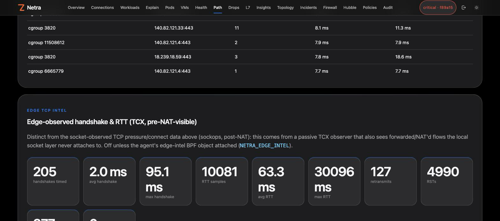

## DNS Response Diagnostics

**Health** and **Explain** now explain native DNS response events, including NXDOMAIN, SERVFAIL, REFUSED, and malformed-request errors, with resolver details and next checks. Use `netractl explain --pod NS/POD --dns NAME`. See [DNS response diagnostics](docs/dns-response-diagnostics.md).

## ICMP Diagnostics

The **Health** and **Explain** pages now surface IPv4/IPv6 MTU, unreachable-destination, time-exceeded, and parameter errors observed by Netra’s TC hooks. Use `netractl explain --node NODE` for suggested checks. Evidence stays node/interface-scoped; advertised MTUs are peer claims. See [ICMP diagnostics](docs/icmp-diagnostics.md). Local Docker-name diagnosis is available with `netractl explain --node NODE --docker NAME`; see [Explain](docs/explain.md#local-docker-name-discovery).

## Drop Diagnostics

Netra v0.19 adds a dedicated **Drop Diagnostics** surface independent of Cilium. When the host exposes a modern `kfree_skb` drop-reason tracepoint, the agent attaches an optional raw tracepoint and counts kernel skb drop reasons. It also reports `/proc/net/softnet_stat` backlog drops/time-squeeze events and per-interface receive/transmit drop/error/missed/no-handler counters. Drop-reason counters are intentionally node-level because the kernel tracepoint does not provide a trustworthy Kubernetes workload identity. See `docs/drop-diagnostics.md`.

## Kernel Network Diagnostics

Netra now correlates Linux network-buffer and congestion sysctls with
windowed deltas from `/proc/net/snmp` and `/proc/net/netstat` plus the existing
softnet, interface and qdisc counters. `GET /api/v1/ebpf/kernel-network?window=5m`
and `netractl ebpf kernel-network 5m` explain where loss is occurring and provide
review-only, reversible canary guidance. The Drops dashboard renders the same
per-node findings, rates, reset/warm-up state and full collected tunable
inventory. Netra never writes a sysctl. See
`docs/kernel-network-diagnostics.md`.

The **Congestion Map** dashboard page turns this into a pictorial, cluster-wide view: every layer of the Linux network stack as a stage card across ingress/shared/egress columns, colored by the worst finding right now — a full tinted background per severity (`ok`/`warming`/`warning`/`critical`), not just a border, so a healthy cluster reads as a field of green instead of flat gray. Click a stage to drill into per-node detail, a trend sparkline, and a one-click "Capture on {node}" button that jumps straight into a live packet capture on the offending node.

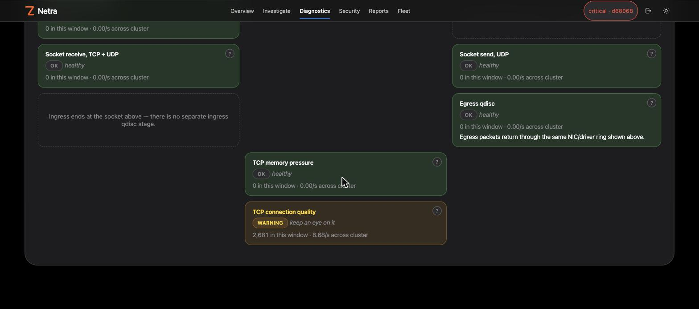

## Packet Capture

The **Capture** dashboard page starts a filtered, time-bounded packet capture on one node or, in one click, a bulk capture across many — streamed live as a macOS-terminal-styled feed, color-coded by protocol and direction. Click any packet for a Wireshark-style layered breakdown (Ethernet II / IP / TCP or UDP or ICMP, each its own color) plus a hex dump, all decoded client-side. Endpoints are labeled automatically when they match a known pod or VM IP, filterable alongside protocol/direction/text. A live packets/sec and bytes/sec sparkline, named filter presets, `.json`/`.csv` export next to the existing `.pcap` download, ended-session history, and a direct line from the Congestion Map (either a manual "Capture on {node}" click or an automatic "Suggested capture" banner when a node has a live critical finding) round it out.

Opt-in **auto-capture** (`NETRA_AUTO_CAPTURE` / Helm `alerting.autoCapture`) starts the same filtered capture automatically on critical softnet drops, Congestion Map findings, and drop-rate spikes, and persists classic PCAPs under `NETRA_AUTO_CAPTURE_DIR` with Download links in capture history. See `docs/capture.md` (backends, auto-capture, and the Linux `scripts/ci-auto-capture-veth.sh` / GitHub `auto-capture-veth` smoke).

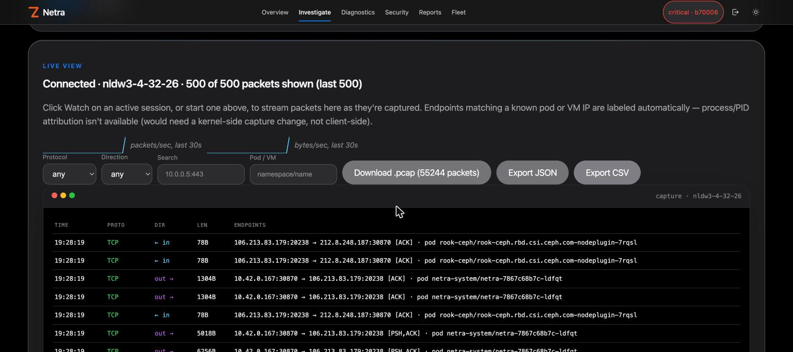

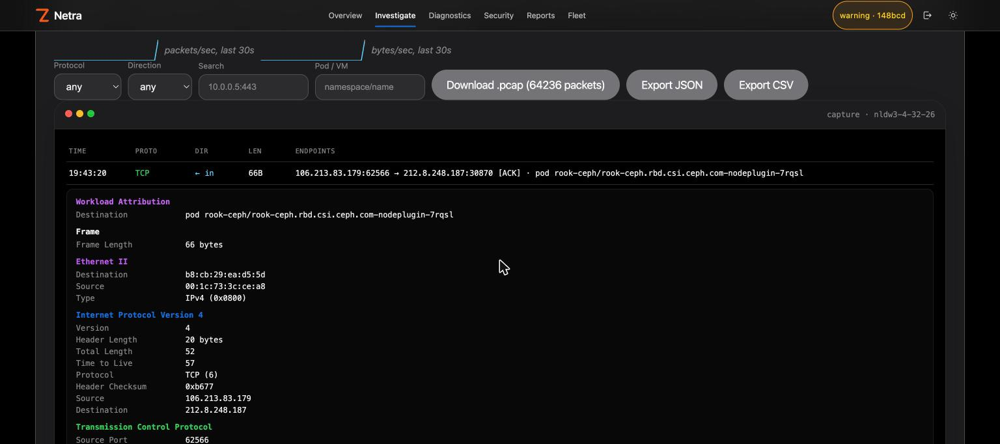

Full workflow — a Congestion Map finding to a live, decoded, color-coded capture on the offending node:

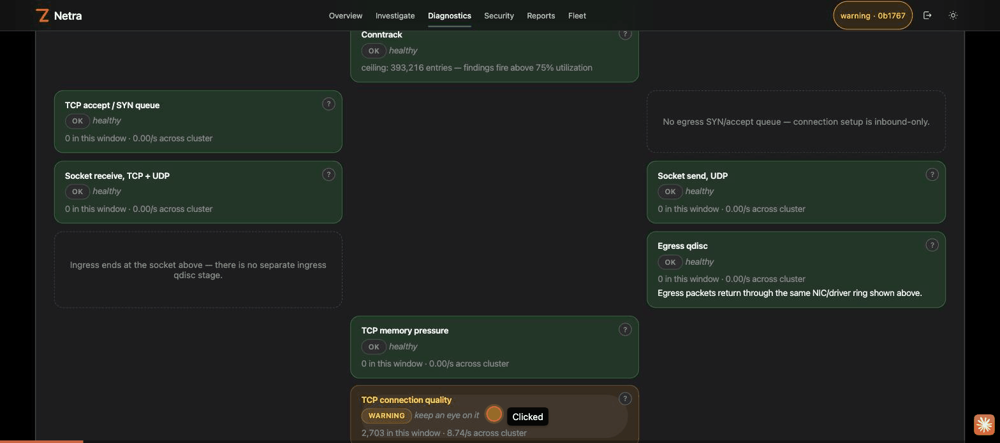

## Behavior and Rate Insights

Netra extends the controller-side behavior layer with real time-window deltas on top of exact eBPF metadata:

- Kubernetes-aware workload dependency graph with Pod and Service resolution;
- persistent known-good behavior baseline;
- drift detection for newly observed destinations, DNS names, TLS SNI, HTTP hosts and remote ports;
- review-only CiliumNetworkPolicy drafts derived from observed workload egress;
- low-cardinality Prometheus gauges for baseline entries, drift findings and dependency edges;
- delta-based packets/bytes/connections/DNS/TLS/HTTP rates over 30s–2h windows;
- a persisted traffic-rate baseline with deterministic 2×/5×/10× drift thresholds;
- workload exposure scoring that combines external dependencies, behavior drift and rate drift;
- review-only remediation proposals for investigation or staged containment.

The behavior baseline remains an **inventory anchor** while the rate baseline is a separate time-window anchor. Rolling samples intentionally warm up again after controller restart/HA failover. Netra never auto-applies learned policy or remediation. See `docs/behavior-insights.md` and `docs/rate-insights.md`.

## Hook model

| Hook | Default | Purpose |
|---|---:|---|
| `cgroup_skb/ingress` | ✅ | CNI-independent descendant workload ingress observation/control |
| `cgroup_skb/egress` | ✅ | CNI-independent descendant workload egress observation/control |
| `cgroup/connect4`, `connect6` | ✅ | new TCP socket process/UID context and deny |
| `cgroup/sendmsg4`, `sendmsg6` | ✅ | UDP send process/UID context and deny |
| `sockops` | ✅ | TCP connection lifecycle, RTT, retransmit/RTO and connection counters |
| raw `kfree_skb` tracepoint | optional | node-level kernel skb drop-reason counters when the host exposes a reason field |
| TCX ingress/egress | optional | interface-level visibility/control on selected interfaces |
| XDP ingress | optional | earliest ingress CIDR/port drop on selected interfaces |

The default agent can therefore run **cgroup-only**: no `cilium_host`, no Cilium maps, and no assumption about the Kubernetes CNI.

> **Scope warning:** `scopeMode=all` attaches enforcement broadly to descendant root-cgroup traffic and can affect Kubernetes workloads plus host/system services. Netra includes `scopeMode=selected`; use it to enforce only resolved workload cgroups after previewing the matching Pods. Traffic whose workload identity cannot be resolved fails open in selected mode, and optional TCX/XDP remain observe-only there.

## Important visibility boundaries

Netra does **not** copy arbitrary packet payloads to userspace. DNS parsing is deliberately limited to ordinary UDP/53 queries. TLS metadata parsing is best-effort and limited to ordinary ClientHello SNI found in a single egress skb; there is no TCP stream reassembly, ECH decryption, QUIC parsing, or certificate inspection. Cleartext HTTP metadata is limited to an HTTP/1 method and `Host` header visible in one skb; request paths/bodies are not exported. It does not inspect DoH, DoT or TCP DNS. IPv6 extension-header walking is implemented (see `docs/ipv6-extension-headers.md`) but does not decrypt ESP payloads, does not trust L4 ports/L7 metadata on non-first fragments, and suppresses L4/L7 parsing on chains deeper than six extension headers. Process-name rules use Linux `comm` (maximum 15 visible bytes) and affect new connect/sendmsg operations; they do not terminate already-established sockets. The PPS guard is an emergency fixed-window limiter, not traffic shaping.

## Optional Cilium / Hubble integration

When enabled, the existing integrations remain available:

- guided and advanced `CiliumNetworkPolicy` authoring;
- live-policy comparison and risk-scored preflight;
- Kubernetes server-side dry-run;
- one-shot durable preflight receipts;
- CNP revision history and guarded rollback;
- native Hubble Relay gRPC flow streaming and drop explanation, with each flow row colored by verdict (forwarded/dropped/audit) and direction.

Cilium RBAC is not rendered by Helm unless `cilium.enabled=true`. Hubble is disabled by default with `hubble.enabled=false`.

When Cilium is enabled, the dashboard also exposes **Pods** and **VMs** (KubeVirt) pages: inventory, per-entity Hubble live flows, create/delete CNP rules pinned to the workload selector, and one-click **lock down / unlock** quarantine (`netra-lockdown-*`: deny-all ingress, DNS-only egress) through the same plan → receipt → apply path.

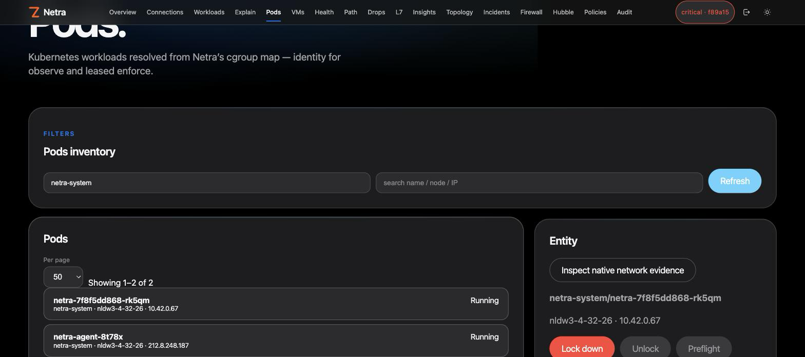

## HTTPS default

`netrad` listens on `:30870` by default. **Helm and plain manifests enable in-pod HTTPS by default** and generate a self-signed P-256 certificate in an init container. The agent opts into certificate verification bypass for that generated internal certificate (`tls.agentInsecureSkipVerify=true` / `NETRA_TLS_INSECURE=true`); use a trusted certificate/CA path in hardened environments instead. Set `tls.enabled=false` (Helm) or remove `NETRA_TLS_CERT`/`NETRA_TLS_KEY` (plain) only when TLS is terminated by a trusted proxy/ingress.

## Signing in

The dashboard sits behind a login screen (`admin` / `Admin@321` by default) —
see [docs/dashboard-login.md](docs/dashboard-login.md) for the full guide,
including what the login maps to server-side and how to rotate the
credential. The nav bar and login screen carry the [Zyvor](https://zyvor.dev)
mark; Netra is Zyvor's open-source eBPF observability product.

## Suite placement (PacketWolf)

Netra and **PacketWolf** cover the same eBPF territory from opposite directions:
PacketWolf is the Cilium-dependent suite flagship; Netra is the standalone
Apache-2.0 layer that works on cgroup v2 alone (Cilium/Hubble optional). They are
**counterparts, not a wired pipeline** — no shared API, CRD, or install pair.

| Choose **Netra** when… | Choose **PacketWolf** when… |
| --- | --- |
| CNI-independent observe + leased emergency kill-switch | Cilium is already the CNI of record |
| Path/Drop/Congestion diagnostics without a full platform | Full AutoPolicy / healer / operator stack |

On a Cilium cluster both may run with clear ownership (PacketWolf for day-2
intelligence; Netra for short-lease deny and CNI-independent diagnostics). Full
rules: [docs/packetwolf.md](docs/packetwolf.md) · site:
[Suite placement](https://zyvorai.github.io/netra/docs/core-concepts/packetwolf).

## Architecture

```text
                        Browser / netractl
                               |
                               v
                    +---------------------+
                    |      netrad        |
                    | API + UI + state    |
                    +----------+----------+
                               |
                 desired config| node reports
                               v
       +------------------------------------------------+
       |          netra-agent on every Linux node      |
       |                                                |
       | cgroup skb + socket hooks       optional TCX   |
       |          |                         optional XDP |
       |          +------ Netra maps/ring buffer ------+
       |                 /sys/fs/bpf/netra             |
       +------------------------------------------------+

         optional                         optional
  +-------------------+             +-------------------+
  | Kubernetes Cilium |             |   Hubble Relay    |
  | NetworkPolicy API |             | Observer.GetFlows |
  +-------------------+             +-------------------+
```

## Repository

```text
cmd/netrad/             controller/API/UI server
cmd/netractl/           operator CLI
cmd/netra-agent/        standalone privileged node agent
cmd/netra-doctor/       read-only host readiness preflight
cmd/netra-mcp/          MCP server: controller API as stdio tools + prompts for AI agents
internal/ai/             heuristic briefs + optional OpenAI-compatible rewrite
internal/agent/          BPF loading, hook attachment and reporting
internal/doctor/         host readiness checks used by netra-doctor
internal/observability/  standalone eBPF summaries and workload topology
internal/health/          TCP/DNS/connect health scoring and anomaly signals
internal/l7/              TLS SNI / HTTP Host / socket-attempt aggregation
internal/insights/         dependency graph, behavior/rate baselines, drift, exposure and drafts
internal/cgroupmeta/     cgroup-v2 Kubernetes path/inode discovery
internal/workload/       workload selector matching and cgroup joins
internal/api/            REST/SSE API
internal/store/          durable state, audit and preflight receipts
internal/siem/           CEF/syslog/JSONL/OTLP formatters + optional syslog push
internal/report/         point-in-time operator briefing builder
internal/playbook/       review-only operator steps from a report snapshot
internal/intel/          threat-intel preview + live feed (apply is lease-gated)
internal/ainet/          GenAI/MCP SaaS destination catalog (metadata observe)
internal/automitigate/   optional leased volumetric auto-mitigation
internal/auditstats/     actor/action/hour rollup of the audit log
internal/coverage/       per-node hook/program coverage matrix
internal/ha/             active/passive controller leader election
internal/kube/           direct Kubernetes REST client
internal/hubble/         optional native Hubble gRPC client
internal/policy/         optional CiliumNetworkPolicy planning
bpf/netra_tc.c          standalone eBPF programs/maps
web/                     React/Vite dashboard
helm/netra/             Helm chart
deploy/                  plain manifests
docs/packetwolf.md       suite placement vs PacketWolf (counterparts, not a pipeline)
docs/standalone-ebpf.md  eBPF hook/map/limitation reference
docs/workload-scoping.md workload attribution/scoping runbook
docs/l7-metadata.md      metadata-only L7 behavior and limitations
docs/behavior-insights.md dependency/inventory-baseline/drift/recommendation runbook
docs/rate-insights.md     time-window rate baseline, exposure and remediation runbook
docs/high-availability.md HA runbook
docs/host-readiness.md    netra-doctor host readiness runbook
docs/drop-detective.md    conntrack + policy Drop Detective
docs/kernel-network-diagnostics.md sysctl/counter correlation and safe tuning workflow
docs/tcx-and-shield.md    TCX modes + XDP Shield
docs/native-netpol.md     optional native NetPol maps: v1 deny-list + v2 allow-list/default-deny
docs/fluxvm-borrow-backlog.md deferred FluxVM eBPF patterns
docs/alerting.md          multi-channel notify + alert poller; opt-in auto-capture env
docs/siem-export.md       pull-based SIEM encodings + operator report
deploy/grafana/           Prometheus dashboard JSON for the existing /metrics gauges
docs/process-metadata.md  optional /proc-derived process metadata (agent-side, hostPID opt-in)
docs/mcp-integration.md   MCP server runbook: tool reference, security, plan/apply flow, troubleshooting
docs/ai.md                heuristic briefs + optional LLM rewrite: HTTP/CLI/MCP surface, safety boundaries
docs/ipv6-diagnostics.md  IPv6 extension-header/fragmentation counters and anomalies
docs/interface-flow-attribution.md per-interface flow counters (TC/TCX hooks only)
docs/chatops.md           Slack ChatOps: slash commands, confirmation flow, Ask Netra integration
docs/chatops-teams.md     Microsoft Teams ChatOps: bot setup, confirm-by-reply flow, validation status
docs/syn-drop.md          SYN-drop mode: exact-IP and CIDR variants, kernel-verified CI coverage
docs/edge-tcp-intel.md    standalone TCX edge observer: handshake/RTT histograms, retransmit/RST/FIN counters
docs/capture.md           packet capture: eBPF vs AF_PACKET, auto-capture PCAPs, veth+iperf3 CI smoke
docs/tls-fingerprints.md  JA3/JA4 datapath + encrypted DNS; openssl+iperf3 CI smoke
docs/p0-p5-surfaces.md    P0–P5 observe surface catalog (what / how / UX / APIs)
docs/p5-surfaces.md       P5 residual boards (JA3 risk, ECH, exfil, lateral, …)
docs/sales/               buyer guide + PDFs/PPTX/DOCX — also on GitHub Pages /resources
docs/sales/buyers-guide.md evaluation narrative for buyers (P0–P5 + checklist)
scripts/ci-auto-capture-veth.sh  Linux root smoke for auto-capture (GitHub job `auto-capture-veth`)
scripts/ci-tlsfp-smoke.sh        Linux root smoke for always-on JA3 (GitHub job `tlsfp-smoke`)
scripts/ci-tlsfp-unit.sh         tlsfp + API JA3 unit/race (GitHub `go` job)
scripts/ci-p1-p5-unit.sh         P1–P5 surface package unit/race (GitHub `go` job)
scripts/ci-ebpf-tests.sh         BPF C helpers + clang + PROG_TEST_RUN (GitHub `ebpf` job)
```

## Buyer resources

- Buyers guide (markdown): [`docs/sales/buyers-guide.md`](docs/sales/buyers-guide.md)
- Feature catalog: [`docs/p0-p5-surfaces.md`](docs/p0-p5-surfaces.md)
- Product Perspective / Brochure (PDF, PPTX, DOCX): [`docs/sales/`](docs/sales/)
- GitHub Pages: https://zyvorai.github.io/netra/resources

## Prerequisites

Standalone mode requires Linux with cgroup v2, bpffs at `/sys/fs/bpf`, and kernel BPF support. The ring-buffer-based implementation has a practical **Linux 5.8+** baseline; use a modern LTS kernel in production. TCX is optional and has a newer kernel requirement (Linux 6.6+ is the practical baseline used by this project). XDP support depends on the selected interface/driver and is off unless explicitly configured.

Before deploying the privileged node agent, run `netra-doctor` (see `docs/host-readiness.md`) to verify cgroup v2, bpffs, BTF, tracefs and related host gates. Use `--require-tcx` / `--require-drop-reasons` when those optional features are mandatory.

Build requirements are Go 1.27, Node 22 and Clang/LLVM with a BPF target.

## Build

```bash
npm --prefix web install
npm --prefix web run build
go mod tidy
go test ./...
go build ./cmd/netrad ./cmd/netractl ./cmd/netra-agent
make bpf
```

Container images:

```bash
docker build -t ghcr.io/zyvorai/netra:0.27.71 .
docker build -f Dockerfile.agent -t ghcr.io/zyvorai/netra-agent:0.27.71 .
```

## Standalone Helm install

Generate independent API and agent credentials. The privileged **node agent
DaemonSet is on by default** (one pod per node, `tolerations: Exists` — same
coverage idea as a CNI agent). Opt out with `--set agent.enabled=false` for a
controller-only install.

```bash
# Prefer the Cilium-style wrapper (banner, agent+TLS defaults, key generation):
netractl install --namespace netra-system
# or classic Helm:
helm upgrade --install netra ./helm/netra \
  --namespace netra-system --create-namespace \
  --set auth.apiKey="$(openssl rand -hex 32)" \
  --set auth.agentKey="$(openssl rand -hex 32)"
```

Then:

```bash
export NETRA_URL=https://127.0.0.1:30870
export NETRA_API_KEY='…'          # from install output / Secret
export NETRA_TLS_INSECURE=true    # chart self-signed cert
netractl status
netractl features list
netractl features enable dns-detect --yes
```

See [`docs/features.md`](docs/features.md) for the full feature catalog, API,
and dashboard **Features** page.
This uses cgroup hooks and requires neither Cilium nor a configured interface. TCX can be enabled for explicit interfaces or all up non-loopback interfaces:

```bash
--set agent.interfaces=eth0
# or
--set agent.interfaces=auto
```

XDP is deliberately explicit:

```bash
--set agent.xdpInterfaces=eth0
```

Do not enable XDP blindly across interfaces; validate driver/kernel compatibility and desired policy scope first.

### Optional Cilium + Hubble

```bash
helm upgrade --install netra ./helm/netra \
  --namespace netra-system --reuse-values \
  --set cilium.enabled=true \
  --set hubble.enabled=true
```

`cilium.enabled=true` renders CiliumNetworkPolicy RBAC. `hubble.enabled=true` makes the controller connect to `hubble-relay.kube-system.svc:80` unless `hubble.address` is overridden.

For plain manifests, see `deploy/README.md`. `deploy/rbac-cilium.yaml` is intentionally separate and optional.

## eBPF CLI examples

```bash
export NETRA_URL=https://127.0.0.1:30870
export NETRA_API_KEY='...'
# Only for the chart-generated self-signed certificate:
export NETRA_TLS_INSECURE=true

netractl ebpf summary
netractl ebpf capabilities
netractl ebpf health
netractl ebpf workloads
netractl ebpf scope show

# preview/select workload scope before enforcement
netractl ebpf scope selected --namespace payments --label app=checkout

# rules can be staged while observe-only
netractl ebpf deny add 203.0.113.10
netractl ebpf deny add 2001:db8::10
netractl ebpf cidr add 10.0.0.0/8 egress
netractl ebpf port add TCP 22 both
netractl ebpf uid add 1000
netractl ebpf process add curl
netractl ebpf dns add telemetry.example.com
netractl ebpf rate set 203.0.113.50 1500

# enforcement is leased, never permanent by default
netractl ebpf mode enforce 15m
netractl ebpf mode observe
```

The same controls are available in the **Firewall** dashboard page, including workload scope preview, discovered workloads, per-node selected-cgroup coverage and workload topology.

Behavior Insights CLI:

```bash
netractl insights summary
netractl insights dependencies
netractl insights baseline capture
netractl insights drift
netractl insights recommendations prod checkout

# time-window rate intelligence
netractl insights rates 5m
netractl insights rate-baseline capture 5m
netractl insights rate-drift 5m
netractl insights exposure 5m
netractl insights remediations 5m
```

AI briefs (heuristic by default; see `docs/ai.md`):

```bash
netractl ai status
netractl ai brief
netractl ai digest
netractl ai draft deny dns malware.example
netractl ai explain dns-failure high SERVFAIL ratio
netractl ai ask why is DNS failing in kube-system?
```

## Safety and persistence

Netra is secure-by-default: the controller requires independent API and agent credentials unless `NETRA_ALLOW_UNAUTHENTICATED=true` is explicitly set for local development. The privileged agent uses a tokenless ServiceAccount. The controller alone receives read-only `get/list` RBAC for Pods and Services to provide workload attribution and dependency resolution; Cilium RBAC remains opt-in.

Controller state is restart-durable when `NETRA_STATE_FILE` is configured. Active/passive HA uses Kubernetes Lease election plus a shared state-file lock. A leader transition or controller restart never resurrects an old eBPF enforcement lease: the datapath returns to observe first.

See the [Security](https://zyvorai.github.io/netra/docs/security) docs page, `docs/standalone-ebpf.md`, `docs/workload-scoping.md`, `docs/behavior-insights.md`, `docs/rate-insights.md`, and `docs/high-availability.md` before production deployment. CI (`.github/workflows/ci.yml`) runs the current, living validation checks (Go build/vet/test, web typecheck/test/build, Helm lint/render, and a real `clang` BPF compile check) on every push.

## License

### Open source (Apache-2.0)

This repository is licensed under the [Apache License, Version 2.0](LICENSE).
You may use, modify, and run it for personal, lab, and commercial production
use at no charge, subject to Apache-2.0 (preserve notices / NOTICE where required).

### Enterprise

Production support, SLAs, and Zyvor Enterprise products are licensed separately.
Contact [sales@zyvor.dev](mailto:sales@zyvor.dev) or see [zyvor.dev](https://zyvor.dev).
