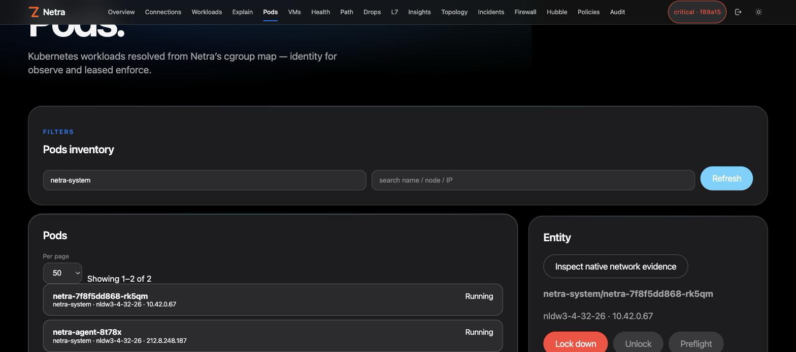

# Architecture and hook model

Moved from the README.

## Hook model

| Hook | Default | Purpose |
|---|---:|---|
| `cgroup_skb/ingress` | ✅ | CNI-independent descendant workload ingress observation/control |
| `cgroup_skb/egress` | ✅ | CNI-independent descendant workload egress observation/control |
| `cgroup/connect4`, `connect6` | ✅ | new TCP socket process/UID context and deny |
| `cgroup/sendmsg4`, `sendmsg6` | ✅ | UDP send process/UID context and deny |
| `sockops` | ✅ | TCP connection lifecycle, RTT, retransmit/RTO and connection counters |
| raw `kfree_skb` tracepoint | optional | node-level kernel skb drop-reason counters when the host exposes a reason field |
| TCX ingress/egress | optional | interface-level visibility/control on selected interfaces |
| XDP ingress | optional | earliest ingress CIDR/port drop on selected interfaces |

The default agent can therefore run **cgroup-only**: no `cilium_host`, no Cilium maps, and no assumption about the Kubernetes CNI.

> **Scope warning:** `scopeMode=all` attaches enforcement broadly to descendant root-cgroup traffic and can affect Kubernetes workloads plus host/system services. Netra includes `scopeMode=selected`; use it to enforce only resolved workload cgroups after previewing the matching Pods. Traffic whose workload identity cannot be resolved fails open in selected mode, and optional TCX/XDP remain observe-only there.

## Important visibility boundaries

By default Netra does **not** copy packet payloads to userspace; the two opt-in sensors (sampled L7, off by default, and TLS plaintext sampling through OpenSSL uprobes, off by default and limitable to named processes in the kernel) copy the first bytes of selected payloads to the agent, parse them there into allowlisted operation counts, and never export them (`docs/l7-sampling.md`, `docs/tls-plaintext.md`). DNS parsing is deliberately limited to ordinary UDP/53 queries. TLS metadata parsing is best-effort and limited to ordinary ClientHello SNI found in a single egress skb; there is no TCP stream reassembly, ECH decryption, QUIC parsing, or certificate inspection. Cleartext HTTP metadata is limited to an HTTP/1 method and `Host` header visible in one skb; request paths/bodies are not exported. It does not inspect DoH, DoT or TCP DNS. IPv6 extension-header walking is implemented (see `docs/ipv6-extension-headers.md`) but does not decrypt ESP payloads, does not trust L4 ports/L7 metadata on non-first fragments, and suppresses L4/L7 parsing on chains deeper than six extension headers. Process-name rules use Linux `comm` (maximum 15 visible bytes) and affect new connect/sendmsg operations; they do not terminate already-established sockets. The PPS guard is an emergency fixed-window limiter, not traffic shaping.

## Optional Cilium / Hubble integration

When enabled, the existing integrations remain available:

- guided and advanced `CiliumNetworkPolicy` authoring;
- live-policy comparison and risk-scored preflight;
- Kubernetes server-side dry-run;
- one-shot durable preflight receipts;
- CNP revision history and guarded rollback;
- native Hubble Relay gRPC flow streaming and drop explanation, with each flow row colored by verdict (forwarded/dropped/audit) and direction.

Cilium RBAC is not rendered by Helm unless `cilium.enabled=true`. Hubble is disabled by default with `hubble.enabled=false`.

When Cilium is enabled, the dashboard also exposes **Pods** and **VMs** (KubeVirt) pages: inventory, per-entity Hubble live flows, create/delete CNP rules pinned to the workload selector, and one-click **lock down / unlock** quarantine (`netra-lockdown-*`: deny-all ingress, DNS-only egress) through the same plan → receipt → apply path.



## HTTPS default

`netrad` listens on `:30870` by default. **Helm and plain manifests enable in-pod HTTPS by default** and generate a self-signed P-256 certificate in an init container. The agent opts into certificate verification bypass for that generated internal certificate (`tls.agentInsecureSkipVerify=true` / `NETRA_TLS_INSECURE=true`); use a trusted certificate/CA path in hardened environments instead. Set `tls.enabled=false` (Helm) or remove `NETRA_TLS_CERT`/`NETRA_TLS_KEY` (plain) only when TLS is terminated by a trusted proxy/ingress.

**CLI:** `netractl` skips verify on loopback when `NETRA_TLS_INSECURE` is unset, and loads `~/.netra/env` + `~/.netra/api-key` automatically (`deploy-remote.sh` writes those). For NodePort over a public IP, set `NETRA_TLS_INSECURE=true` or use `~/.netra/env`. See [`docs/netractl.md`](netractl.md).

## Architecture

```text
                        Browser / netractl
                               |
                               v
                    +---------------------+
                    |      netrad        |
                    | API + UI + state    |
                    +----------+----------+
                               |
                 desired config| node reports
                               v
       +------------------------------------------------+
       |          netra-agent on every Linux node      |
       |                                                |
       | cgroup skb + socket hooks       optional TCX   |
       |          |                         optional XDP |
       |          +------ Netra maps/ring buffer ------+
       |                 /sys/fs/bpf/netra             |
       +------------------------------------------------+

         optional                         optional
  +-------------------+             +-------------------+
  | Kubernetes Cilium |             |   Hubble Relay    |
  | NetworkPolicy API |             | Observer.GetFlows |
  +-------------------+             +-------------------+
```
