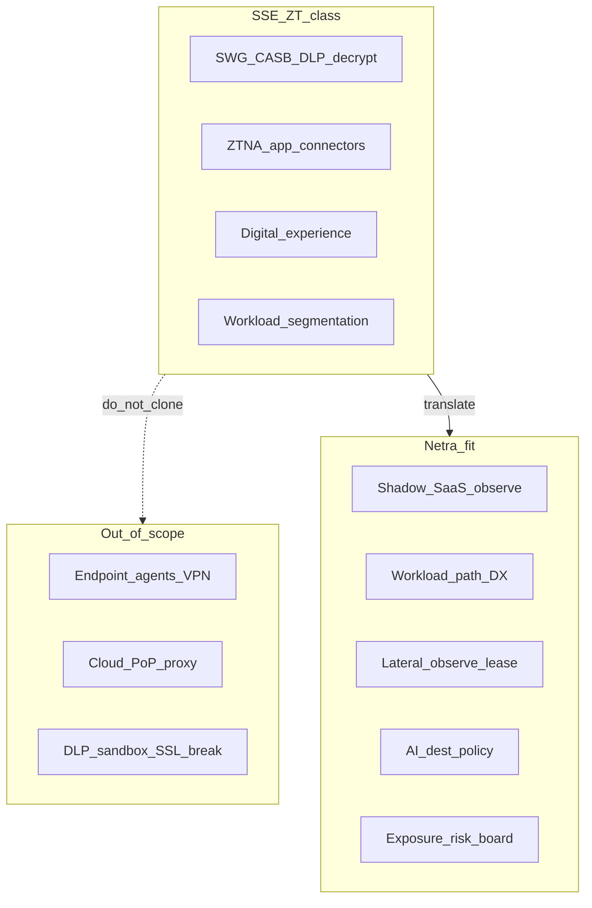

# Cloud SSE / Zero Trust → Netra feature gaps

Internal product strategy. Compares Netra to a typical **cloud security
service edge / Zero Trust** class of product (secure web gateway, ZTNA,
digital experience monitoring, workload segmentation, AI-era SecOps).

Pairs with the perimeter-NGFW view in [`competitive-quantum.md`](competitive-quantum.md).
Netra should **not** become a cloud SWG, ZTNA broker, or remote-user agent.

## Positioning

| | **Cloud SSE / ZT (class)** | **Netra (today)** |
|---|---|---|
| Job | Inline cloud broker: users/devices/branches → apps with decrypt + policy | **CNI-independent** host eBPF observe + stack diagnostics + **leased** emergency deny |
| Datapath | Global PoPs, client agents, app connectors | Node maps under `/sys/fs/bpf/netra` (`netractl ebpf maps`) |
| Trust model | Identity + device posture → app (not network) | Workload/cgroup identity on the node; lease fails open |
| Payload | TLS intercept, DLP, CASB, sandbox | Explicitly **no** payloads, argv, Secrets |
| Suite mate | Full SASE (often + SD-WAN) | PacketWolf = Cilium-first durable microseg |

## SSE / ZT pillars → Netra status

| Theme (class) | Typical capability | Netra today | Gap for Netra? |
|---|---|---|---|
| Secure web gateway / URL filter | Cloud SWG | SNI/Host/DNS + app categories | **Partial** — richer category/risk scores without decrypt |
| SSL/TLS inspection | Decrypt at PoP | SNI + capture JA3/JA4 | **No decrypt**; keep fingerprint / encrypted-DNS path |
| CASB / sanctioned SaaS | App control + content | `app-categories` + shadow-SaaS + AI destinations | **Shipped (lite)** — metadata only |
| DLP / data exfil content | Payload scan | None (payload ban) | **No** — volume/fan-out heuristics only |
| Cloud firewall / FWaaS | Cloud edge ACL | Leased deny / rate / Shield | **Adjacent** — emergency, not cloud FWaaS |
| ZTNA / replace VPN | User→app broker | None | **No** — out of scope |
| App connector / inside-out | DC connectors | None | **No** |
| Digital experience | Endpoint→app path UX | Workload DX scorecard + path/drop/TCP | **Shipped (lite)** |
| Workload microseg | Least-priv east-west | `microseg` + ZT drafts; PacketWolf on Cilium | **Suite** — PacketWolf durable; Netra lease |
| Lateral movement stop | Inline block | `scandetect` + leased conn-rate | **Partial** — lease-gated |
| AI / GenAI security | AI traffic policy | AI destination observe + deny | **Shipped** |
| Agentic SecOps | NL admin / SOC speed | Read-only AI + gated MCP | **Partial** — drafts only |
| Deception / browser isolation | Adjacent SKUs | None | **No** |

## Residual perimeter-NGFW ideas (metadata-fit)

| Idea | Netra-fit translation | Status |
|---|---|---|
| Live threat feeds | Intel feed + hits + leased apply | Shipped |
| Prevention insights | Prevention coverage report | Shipped |
| App control without DPI | App categories | Shipped (heuristic) |
| Encrypted traffic intel | JA3/JA4 + DoH/DoT | Shipped (datapath + capture JA3) |
| IoT/OT | Only if Linux OT hosts appear | Non-goal for ICS DPI |

## Prioritized Netra-fit backlog

### P3 — Highest buyer overlap without becoming SSE (implemented)

1. **Shadow SaaS board** — [`shadow-saas.md`](shadow-saas.md).
2. **Workload digital-experience scorecard** — [`experience.md`](experience.md).
3. **Destination risk scoring** — [`destination-risk.md`](destination-risk.md).
4. **Always-on JA3** — datapath via `bpf/netra_tlsfp.c` (+ capture);
   [`tls-fingerprints.md`](tls-fingerprints.md).

### P4 — Differentiation / suite (implemented)

5. **Sanctioned-app policy packs** — review-only Cilium/CNP drafts from allow-listed hosts. See [`policy-packs.md`](policy-packs.md).
6. **Partner / MSSP multi-tenant read views** — tenant labels on fleet clusters. See [`fleet-tenants.md`](fleet-tenants.md).
7. **Workload identity drafts** — ServiceAccount / label identity → review-only ZT drafts. See [`identity-drafts.md`](identity-drafts.md).

### P5 — Residual metadata fit (implemented)

8. **JA3 risk + ECH/missing-SNI boards** — datapath ClientHello samples + capture; no decrypt. See [`p5-surfaces.md`](p5-surfaces.md), [`tls-fingerprints.md`](tls-fingerprints.md).
9. **DNS/C2 domain intel** — suffix match + heuristics. See [`p5-surfaces.md`](p5-surfaces.md).
10. **Exfil fan-out heuristics** — not DLP. See [`p5-surfaces.md`](p5-surfaces.md).
11. **Lateral playbooks + category deny drafts** — review-only. See [`p5-surfaces.md`](p5-surfaces.md).

## Explicit non-goals (leave to SSE/ZT vendors or PacketWolf)

- Client agents, app connectors, remote-user ZTNA  
- Cloud PoP proxy / SWG with TLS interception  
- CASB content control, DLP, sandbox, browser isolation  
- SD-WAN / SASE networking fabric  
- Prevention-first inline default on every user connection  

## See also

- [p0-p5-surfaces.md](p0-p5-surfaces.md) — full feature catalog + UX wiring  
- [sales/buyers-guide.md](sales/buyers-guide.md) — buyer evaluation narrative  
- [competitive-quantum.md](competitive-quantum.md) — perimeter NGFW fit  
- [packetwolf.md](packetwolf.md) — durable microseg ownership  
- [ai-destinations.md](ai-destinations.md), [app-categories.md](app-categories.md), [microseg.md](microseg.md)
