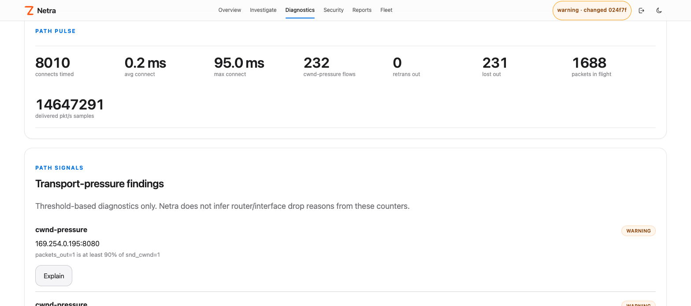
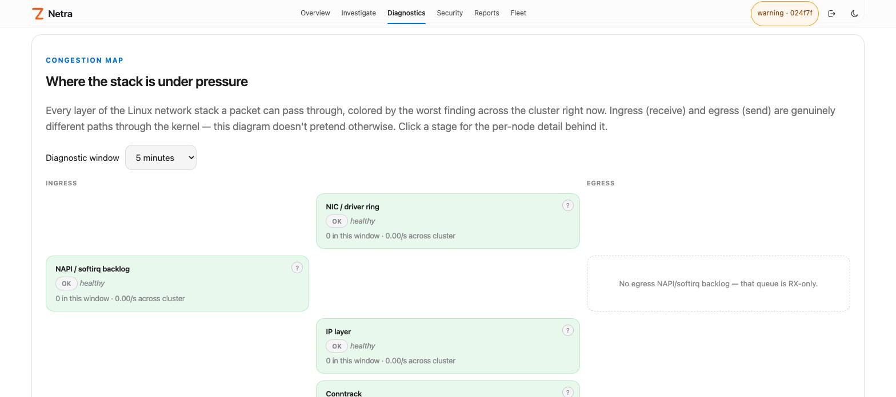
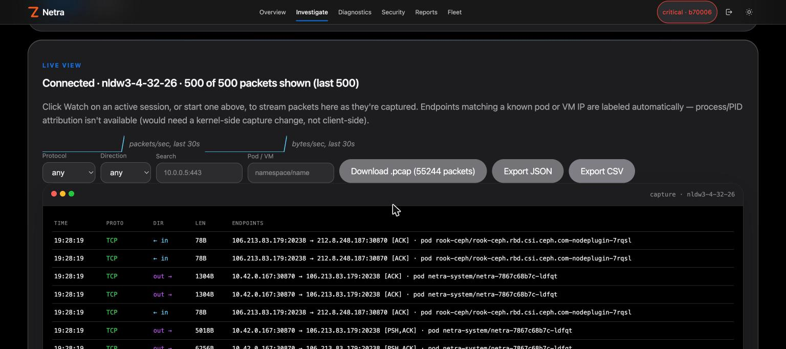
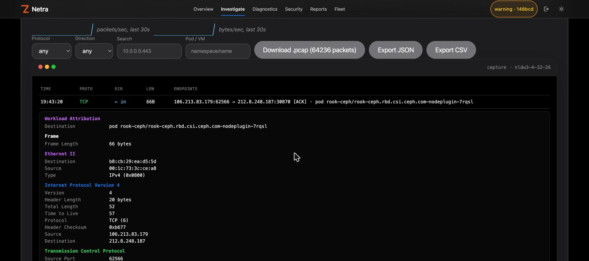
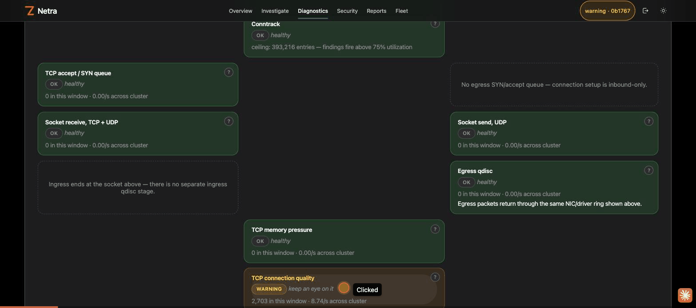

# Diagnostics overview

Path, DNS, ICMP, drop, kernel-network, capture and behavior/rate diagnostics. Moved from the README.

## TCP Path Diagnostics

Netra v0.13 added a dedicated **Path Diagnostics** surface independent of Cilium. It measures active TCP connect establishment latency and exports current Linux TCP transport pressure (`snd_cwnd`, `packets_out`, `retrans_out`, `lost_out`, `total_retrans`, delivered-rate samples and state) per cgroup/workload and remote tuple. The feature is observe-only and uses new maps without resizing earlier pinned-map ABIs. See `docs/path-diagnostics.md`.

A standalone TCX observer adds **edge-observed** handshake/RTT histograms and retransmit/RST/FIN counters alongside the socket-observed data above — pre-NAT-visible, seeing forwarded/NAT'd flows the local socket layer never attaches to. See `docs/edge-tcp-intel.md`.

## DNS Response Diagnostics

**Health** and **Explain** now explain native DNS response events, including NXDOMAIN, SERVFAIL, REFUSED, and malformed-request errors, with resolver details and next checks. Use `netractl explain --pod NS/POD --dns NAME`. See [DNS response diagnostics](dns-response-diagnostics.md).

## ICMP Diagnostics

The **Health** and **Explain** pages now surface IPv4/IPv6 MTU, unreachable-destination, time-exceeded, and parameter errors observed by Netra’s TC hooks. Use `netractl explain --node NODE` for suggested checks. Evidence stays node/interface-scoped; advertised MTUs are peer claims. See [ICMP diagnostics](icmp-diagnostics.md). Local Docker-name diagnosis is available with `netractl explain --node NODE --docker NAME`; see [Explain](explain.md#local-docker-name-discovery).

## Drop Diagnostics

Netra v0.19 adds a dedicated **Drop Diagnostics** surface independent of Cilium. When the host exposes a modern `kfree_skb` drop-reason tracepoint, the agent attaches an optional raw tracepoint and counts kernel skb drop reasons. It also reports `/proc/net/softnet_stat` backlog drops/time-squeeze events and per-interface receive/transmit drop/error/missed/no-handler counters. Drop-reason counters are intentionally node-level because the kernel tracepoint does not provide a trustworthy Kubernetes workload identity. See `docs/drop-diagnostics.md`.

## Kernel Network Diagnostics

Netra now correlates Linux network-buffer and congestion sysctls with
windowed deltas from `/proc/net/snmp` and `/proc/net/netstat` plus the existing
softnet, interface and qdisc counters. `GET /api/v1/ebpf/kernel-network?window=5m`
and `netractl ebpf kernel-network 5m` explain where loss is occurring and provide
review-only, reversible canary guidance. The Drops dashboard renders the same
per-node findings, rates, reset/warm-up state and full collected tunable
inventory. Netra never writes a sysctl. See
`docs/kernel-network-diagnostics.md`.

The **Congestion Map** dashboard page turns this into a pictorial, cluster-wide view: every layer of the Linux network stack as a stage card across ingress/shared/egress columns, colored by the worst finding right now — a full tinted background per severity (`ok`/`warming`/`warning`/`critical`), not just a border, so a healthy cluster reads as a field of green instead of flat gray. Click a stage to drill into per-node detail, a trend sparkline, and a one-click "Capture on {node}" button that jumps straight into a live packet capture on the offending node.

## Packet Capture

The **Capture** dashboard page starts a filtered, time-bounded packet capture on one node or, in one click, a bulk capture across many — streamed live as a macOS-terminal-styled feed, color-coded by protocol and direction. Click any packet for a Wireshark-style layered breakdown (Ethernet II / IP / TCP or UDP or ICMP, each its own color) plus a hex dump, all decoded client-side. Endpoints are labeled automatically when they match a known pod or VM IP, filterable alongside protocol/direction/text. A live packets/sec and bytes/sec sparkline, named filter presets, `.json`/`.csv` export next to the existing `.pcap` download, ended-session history, and a direct line from the Congestion Map (either a manual "Capture on {node}" click or an automatic "Suggested capture" banner when a node has a live critical finding) round it out.

Opt-in **auto-capture** (`NETRA_AUTO_CAPTURE` / Helm `alerting.autoCapture`) starts the same filtered capture automatically on critical softnet drops, Congestion Map findings, and drop-rate spikes, and persists classic PCAPs under `NETRA_AUTO_CAPTURE_DIR` with Download links in capture history. See `docs/capture.md` (backends, auto-capture, and the Linux `scripts/ci-auto-capture-veth.sh` / GitHub `auto-capture-veth` smoke).

Full workflow — a Congestion Map finding to a live, decoded, color-coded capture on the offending node:

## Behavior and Rate Insights

Netra extends the controller-side behavior layer with real time-window deltas on top of exact eBPF metadata:

- Kubernetes-aware workload dependency graph with Pod and Service resolution;
- persistent known-good behavior baseline;
- drift detection for newly observed destinations, DNS names, TLS SNI, HTTP hosts and remote ports;
- review-only CiliumNetworkPolicy drafts derived from observed workload egress;
- low-cardinality Prometheus gauges for baseline entries, drift findings and dependency edges;
- delta-based packets/bytes/connections/DNS/TLS/HTTP rates over 30s–2h windows;
- a persisted traffic-rate baseline with deterministic 2×/5×/10× drift thresholds;
- workload exposure scoring that combines external dependencies, behavior drift and rate drift;
- review-only remediation proposals for investigation or staged containment.

The behavior baseline remains an **inventory anchor** while the rate baseline is a separate time-window anchor. Rolling samples intentionally warm up again after controller restart/HA failover. Netra never auto-applies learned policy or remediation. See `docs/behavior-insights.md` and `docs/rate-insights.md`.
