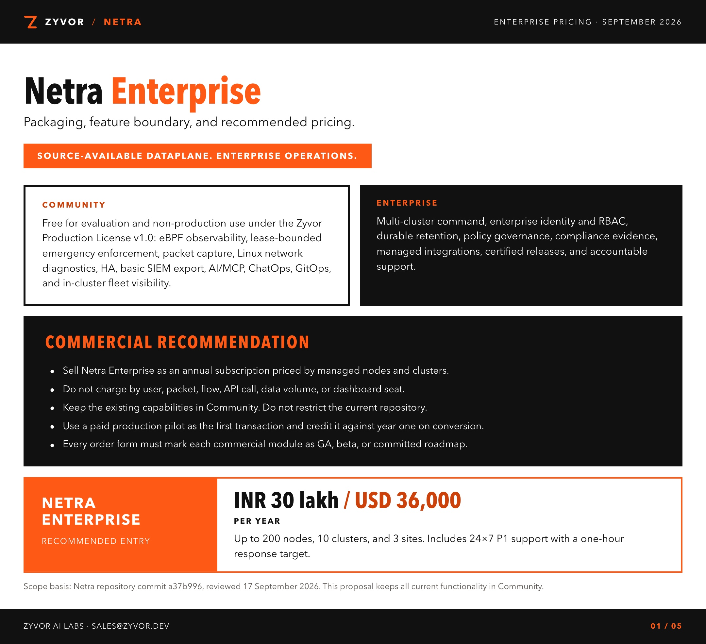
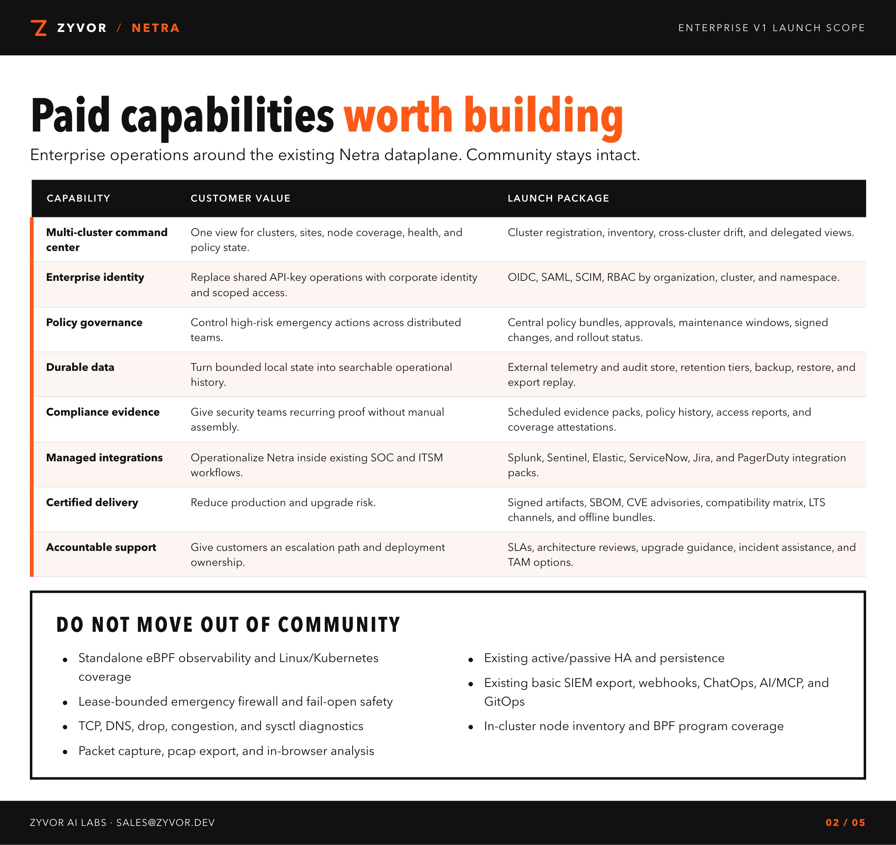
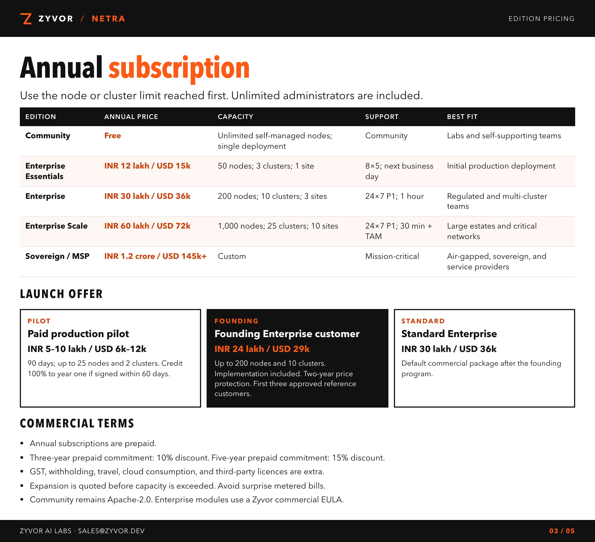
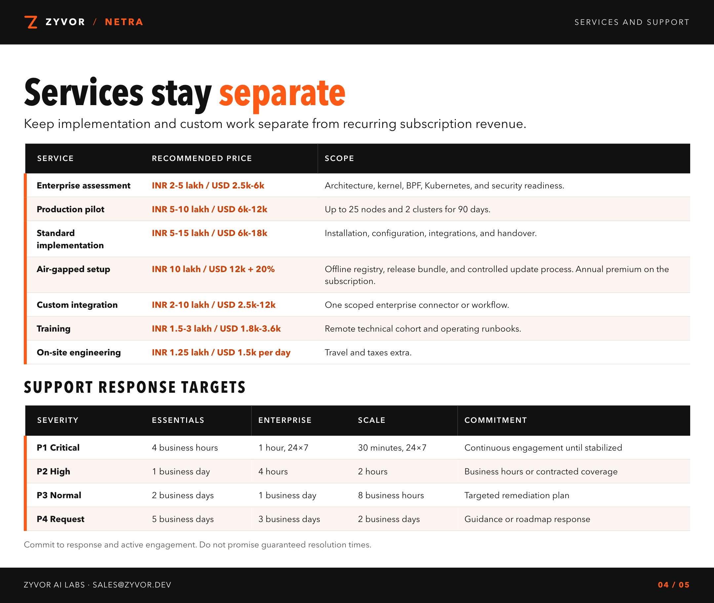
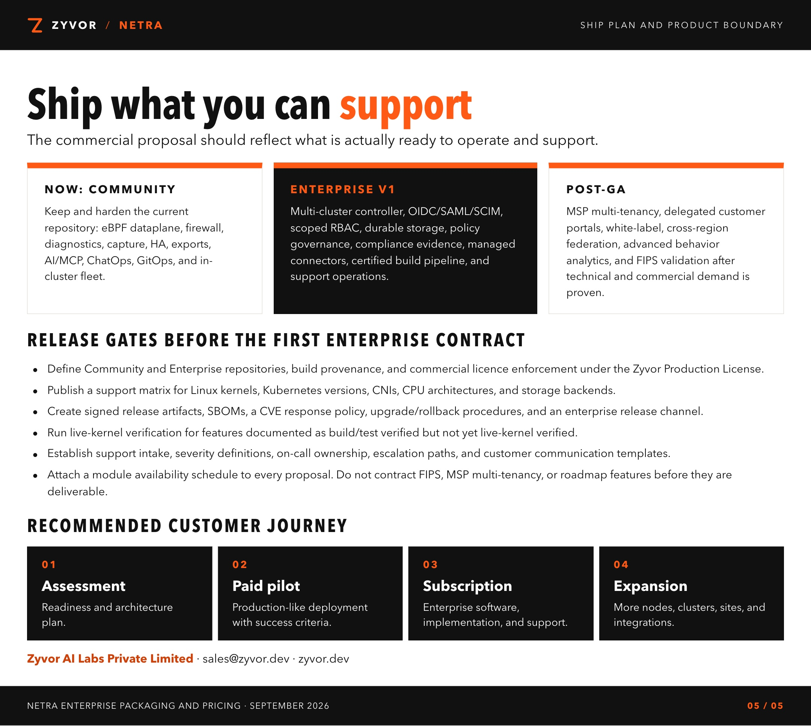

# Netra Enterprise pricing

Packaging, feature boundary, and recommended pricing. September 2026.
Orange, white, and black sheets for GitHub — open dataplane, enterprise operations.

Community stays Apache-2.0. Enterprise is an annual subscription by nodes and clusters, not by user, packet, flow, or seat.

[Download the PDF](./Zyvor-Netra-Enterprise-Pricing.pdf).

Scope basis: Netra repository commit `a37b996`, reviewed 17 September 2026.

Zyvor AI Labs Private Limited · [sales@zyvor.dev](mailto:sales@zyvor.dev) · [zyvor.dev](https://zyvor.dev)
